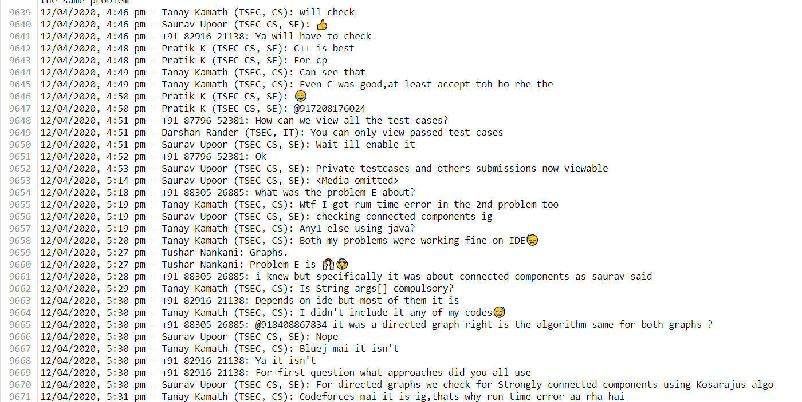

# A Comprehensive Data Analysis on a WhatsApp Group Chat

# *Introduction*:

Whatsapp has quickly become the world’s most popular text and voice messaging application. Specializing in cross-platform messaging with over 1.5 billion monthly active users, this makes it the most popular mobile messenger app worldwide.

- But I thought why not do **Data Analysis on a WhatsApp group chat** of *college students* and find out interesting insights about who is most active,Most Busy Day and Month , the most used emoji, the most actives times of the day, Top User interactions, Chat Statistics, Message Timing Patterns, Most Common Words, Monthly Timeline, WordCloud, Weekly Activity Map? 

- These would be some interesting insights for sure, more for me than for you, since the people in this chat are people I know personally.

# *Data Retrieval & Preprocessing*

### Beginning. How do I export my conversations? From Where To Obtain Data?


- The first step is **Data Retrieval & Preprocessing**, that is to **gather the data**. WhatsApp allows you to **export your chats** through a **.txt format**.

<p align="center">

</p>

- Tap on **options**, click on **More**, and **Export Chat.**
 <p align="center">

</p>

- I will be Exporting **Without Media.**
 <p align="center">

</p>

#### NOTE:
- Without media: exports about **40k messages **
- While exporting data, *avoid including media files* because if the number of media files is greater than certain figure then not all the media files are exported.
  
### Opening this .txt file up, you get messages in a format that looks like this:




### *Preparation and reading data*

Since WhatsApp texts are multi-line, you cannot just read the file line by line and get each message that you want. Instead, you need a way to identify if a line is a new message or part of an old message. You could do this use regular expressions, but I went forward with a more simple method, which splits the time formats and creates a DataFrame from a Raw .txt file.

While reading each line, I split it based on a comma and take the first item returned from the `split()` function. If the line is a new message, the first item would be a valid date, and it will be appended as a new message to the list of messages. If it’s not, the message is part of the previous message, and hence, will be appended to the end of the previous message as one continuous message.

```bash
def preprocess(data):
    # Split the data into lines
    lines = data.split('\n')
    
    # Create a list to hold the processed messages
    messages = []
    
    # Regex patterns for multiple timestamp formats
    patterns = {
        '12h_standard': r'(\d{2}/\d{2}/\d{2},\s\d{1,2}:\d{2}\s[APMapm]{2})\s-\s(.*?):\s?(.*)',
        '12h_bracketed': r'\[(\d{2}/\d{2}/\d{2},\s\d{2}:\d{2}:\d{2}\s[APMapm]{2})\]\s(.*?):\s(.*)',
        '12h_extended': r'(\d{2}/\d{2}/\d{4},\s\d{1,2}:\d{2}\s[APMapm]{2})\s-\s(.*?):\s?(.*)',
        
        # 24-hour formats
        '24h_standard': r'(\d{2}/\d{2}/\d{2},\s\d{1,2}:\d{2})\s-\s(.*?):\s?(.*)',
        '24h_bracketed': r'\[(\d{2}/\d{2}/\d{2},\s\d{2}:\d{2}:\d{2})\]\s(.*?):\s(.*)',
        '24h_extended': r'(\d{2}/\d{2}/\d{4},\s\d{1,2}:\d{2})\s-\s(.*?):\s?(.*)'
    }
    
    for line in lines:
        line = line.strip()
        if not line:
            continue
        
        matched = False
        for pattern in patterns.values():
            match = re.match(pattern, line)
            if match:
                date_time, user, message = match.groups()
                messages.append([date_time, user.strip(), message.strip()])
                matched = True
                break
        
        # Handle continued messages
        if not matched and messages:
            messages[-1][2] += '\n' + line.strip()
```


# *Pre-Processing*

Firstly, let’s load our .txt into a DataFrame.
```bash
df = pd.DataFrame(messages, columns=['date', 'user', 'message'])
```

The dataset now contains 3 columns - DateTime String, User, and Message sent and their respective entries in rows.

**Let’s create some helper columns for better analysis!**

```bash
    df['only_date'] = df['date'].dt.date
    df['year'] = df['date'].dt.year
    df['month'] = df['date'].dt.month_name()
    df['month_num'] = df['date'].dt.month
    df['day'] = df['date'].dt.day
    df['day_name'] = df['date'].dt.day_name()
    df['hour'] = df['date'].dt.hour
    df['minute'] = df['date'].dt.minute
    df['second'] = df['date'].dt.second
```

Now that we have a clean DataFrame to work with, it’s time to perform analysis on it. **Let’s start Visualizing!**


# *Run locally*
Install the required dependencies:
```bash
pip install -r requirements.txt
```
To run the app, type following command in terminal.
```bash
streamlit run app.py
```

# *Live Demo*

https://whatsapp-chat-analyzer-by-aksh-patel.streamlit.app/

#  *Limitation of Project*

- Maximum file size to be uploaded is 200MB.
- Supports only txt extension.
- Only supports English languages.


# *Exploratory Data Analysis*


